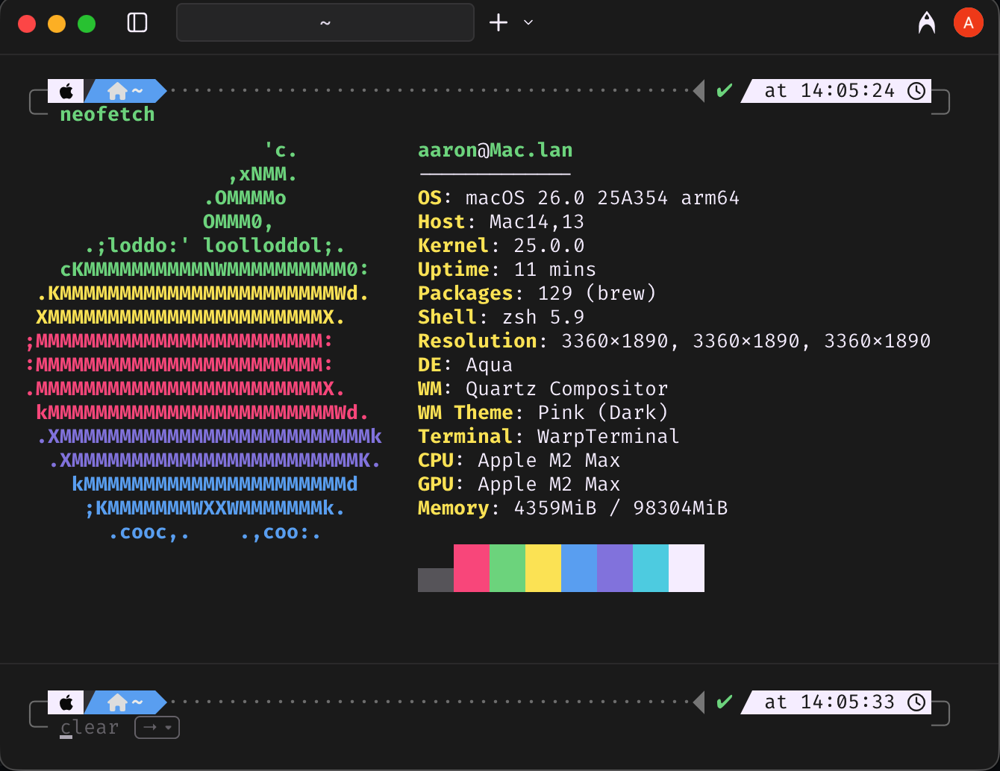

# Aaron's Dotfiles

[![Lint][lint-badge]][lint-workflow]
![GitHub last commit][last-commit-badge]
[![GitHub License][license-badge]][license]



## Installation

```bash
sh -c "$(curl -fsLS https://raw.githubusercontent.com/aaronmallen/dotfiles/refs/heads/main/install)"
```

## Supported Operating Systems

* MacOS
* Arch Linux

## Tooling

### Dotfiles Management

* [chezmoi](https://chezmoi.io) - Dotfiles manager

### Shell & Terminal

* [Warp](https://www.warp.dev) - Modern terminal
* [Zsh](https://www.zsh.org) - Shell with Starship prompt
* [Starship](https://starship.rs) - Cross-shell prompt
* [Atuin](https://github.com/atuinsh/atuin) - Shell history sync
* [Zoxide](https://github.com/ajeetdsouza/zoxide) - Smarter cd command

### Development Tools

* [JJ](https://jj-vcs.github.io/) - Version control
* [GitHub CLI](https://cli.github.com) - GitHub command line tool
* [Docker](https://www.docker.com) - Containerization platform

### IDEs & Editors

* **Primary:** JetBrains IDEs

  * [RubyMine](https://www.jetbrains.com/ruby/) - Ruby/Rails IDE
  * [RustRover](https://www.jetbrains.com/rust/) - Rust IDE
  * [DataGrip](https://www.jetbrains.com/datagrip/) - Database IDE

* **Alternatives:**

  * [Zed](https://zed.dev) - Lightweight code editor
  * [Neovim](https://neovim.io) - Terminal-based text editor

### Languages & Runtimes

* Ruby (via mise)
* Rust (via mise)
* Node.js/JavaScript (via mise)

### CLI Utilities

* [bat](https://github.com/sharkdp/bat) - Better `cat` with syntax highlighting
* [bat-extras](https://github.com/eth-p/bat-extras) - Additional bat utilities
* [lsd](https://github.com/lsd-rs/lsd) - Modern `ls` replacement
* [fzf](https://github.com/junegunn/fzf) - Fuzzy finder
* [ripgrep](https://github.com/BurntSushi/ripgrep) - Fast grep alternative
* [delta](https://github.com/dandavison/delta) - Syntax-highlighting pager for git
* [tlrc](https://github.com/tldr-pages/tlrc) - tldr pages client
* [glow](https://github.com/charmbracelet/glow) - Markdown renderer
* [xdg-ninja](https://github.com/b3nj5m1n/xdg-ninja) - Check XDG compliance

### Package Management

* [Mise](https://mise.jdx.dev) - Development environment manager (manages tool versions)
* [Homebrew](https://brew.sh) - macOS package manager
* [Paru](https://github.com/Morganamilo/paru) - Arch Linux pacman helper
* [Yay](https://github.com/Jguer/yay) - Arch Linux pacman helper

### Security & Privacy

* [1Password](https://1password.com) - Password manager with CLI

## Inspiration

Heavily inspired by [holman dotfiles](https://github.com/holman/dotfiles)

[last-commit-badge]: https://img.shields.io/github/last-commit/aaronmallen/dotfiles?style=for-the-badge
[license]: https://github.com/aaronmallen/dotfiles/blob/main/LICENSE
[license-badge]: https://img.shields.io/github/license/aaronmallen/dotfiles?style=for-the-badge&color=blue
[lint-badge]: https://img.shields.io/github/actions/workflow/status/aaronmallen/dotfiles/lint.yml?style=for-the-badge&logo=githubactions&logoColor=white&label=lint
[lint-workflow]: https://github.com/aaronmallen/dotfiles/actions/workflows/lint.yml
